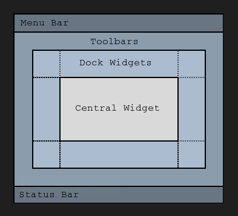

# IPC exchanger

## Part I

### Build and debug
```
cmake .. -DCMAKE_BUILD_TYPE=Debug
cmake --build 
```

### General protocol module
We have three main structures for packing messages: [ MAGIC (4 bytes) ][ SIZE (4 bytes) ][ PAYLOAD (SIZE bytes) ]
 - `MAGIC`
 - `SIZE`
 - `PAYLOAD`

 ### QMainWindow documentation:
 - https://doc.qt.io/qt-6/qmainwindow.html

 
```
 MainWindow (QMainWindow)
  └─ centralWidget (QWidget)
       └─ layout (QVBoxLayout) [manager, not widget]
            ├─ label_received_ (QLabel)
            └─ label_local_ (QLabel)
```

```
<body style="display: flex; flex-direction: column;">   <!-- QMainWindow -->
  <main style="flex: 1;">                               <!-- central widget -->
    <div style="display: flex; flex-direction: column;">  <!-- QVBoxLayout -->
      <span>Полученное время от Sender: ---</span>        <!-- label_received_ -->
      <span>Моё локальное время: ---</span>              <!-- label_local_ -->
    </div>
  </main>
</body>
```